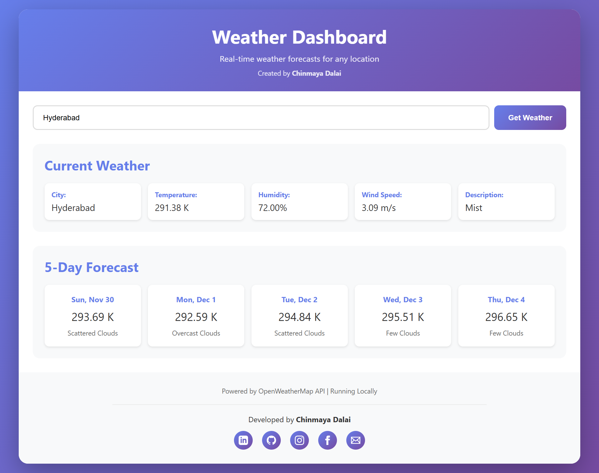
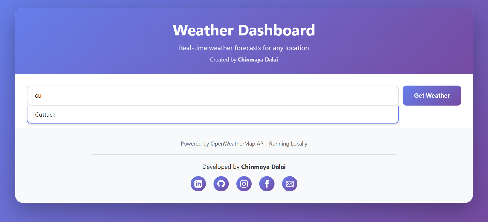
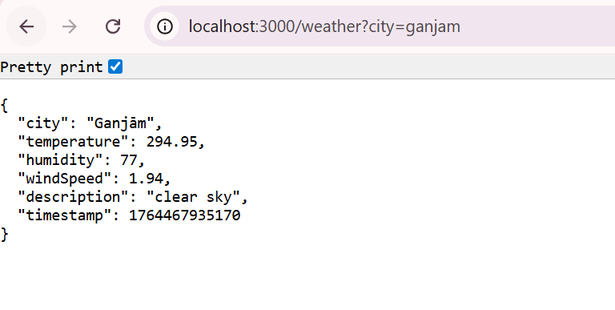

# 🌤️ Weather Dashboard

[](https://opensource.org/licenses/MIT)
[](https://nodejs.org/)
[](https://aws.amazon.com/)

A modern, serverless weather dashboard providing real-time weather forecasts for any city worldwide. Built with AWS Lambda, API Gateway, S3, and the OpenWeatherMap API.

**✨ Features:** Current Weather • 5-Day Forecast • City Autocomplete • Responsive Design • Dual Deployment (Local + AWS)

**👨‍💻 Developed by:** [Chinmaya Dalai](https://www.linkedin.com/in/chinmayadalai)

---

## 📸 Screenshots

### Weather Dashboard - Full View

*Complete weather dashboard showing current weather and 5-day forecast for Hyderabad*

### City Autocomplete Feature

*Smart city suggestions appear after typing 2 letters*

### Backend API Response

*JSON response from the weather API endpoint*

---

## Features

- **Current Weather**: Display temperature, humidity, wind speed, and weather description
- **5-Day Forecast**: View weather predictions for the next 5 days
- **City Search**: Search for weather information by city name
- **Responsive Design**: Works seamlessly on desktop, tablet, and mobile devices
- **Serverless Architecture**: Built on AWS for automatic scaling and high availability

## Architecture

```
Browser → CloudFront (Optional) → S3 (Static Files)
Browser → API Gateway → Lambda Function → OpenWeatherMap API
```

### Technology Stack

- **Frontend**: HTML5, CSS3, Vanilla JavaScript
- **Backend**: AWS Lambda (Node.js 18.x)
- **API**: AWS API Gateway (REST API)
- **Storage**: AWS S3 (Static Website Hosting)
- **CDN**: AWS CloudFront (Optional)
- **External API**: OpenWeatherMap API (Free Tier)

## 🐳 Docker Deployment (Easiest!)

```bash
# Clone and start with Docker
git clone https://github.com/YOUR_USERNAME/weather-dashboard.git
cd weather-dashboard
cp .env.example .env
# Add your API key to .env
docker-compose up -d
```

**Access:**
- Frontend: http://localhost:8080
- Backend API: http://localhost:3000

📖 **Full Docker Guide:** [DOCKER.md](DOCKER.md)

## Prerequisites

### For Docker Deployment
- Docker & Docker Compose installed
- OpenWeatherMap API Key ([Get free key](https://openweathermap.org/api))

### For Local Development
- Node.js 18.x or later
- OpenWeatherMap API Key

### For AWS Deployment
- AWS Account
- AWS CLI installed and configured
- OpenWeatherMap API Key
- Node.js 18.x or later
- Bash shell (for deployment scripts)

## Project Structure

```
newproject/
├── frontend/              # Frontend application
│   ├── index.html        # Main HTML file
│   ├── styles.css        # Styling
│   └── app.js            # JavaScript logic
├── lambda/               # Lambda function code
│   ├── index.js          # Lambda handler
│   ├── package.json      # Dependencies
│   └── jest.config.js    # Test configuration
├── infrastructure/       # CloudFormation templates
│   ├── cloudformation-template.yaml
│   ├── s3-bucket-template.yaml
│   ├── cloudfront-template.yaml
│   └── monitoring-template.yaml
├── scripts/              # Deployment scripts
│   ├── deploy-infrastructure.sh
│   ├── deploy-lambda.sh
│   ├── deploy-frontend.sh
│   └── invalidate-cloudfront.sh
└── .env.example          # Environment variables template
```

## Setup Instructions

### 1. Get OpenWeatherMap API Key

1. Sign up at https://openweathermap.org/
2. Navigate to API Keys section
3. Generate a new API key (free tier allows 60 calls/minute)

### 2. Deploy Infrastructure

```bash
cd scripts
chmod +x *.sh
./deploy-infrastructure.sh
```

This will:
- Deploy Lambda function with IAM role
- Create API Gateway with endpoints
- Set up S3 bucket for static hosting
- Configure CloudWatch logging

You'll be prompted for:
- OpenWeatherMap API Key
- Unique S3 bucket name

### 3. Update Frontend Configuration

After infrastructure deployment, update the API Gateway URL in `frontend/app.js`:

```javascript
const API_GATEWAY_URL = 'https://your-api-id.execute-api.region.amazonaws.com/prod';
```

### 4. Deploy Lambda Function

```bash
cd scripts
./deploy-lambda.sh
```

### 5. Deploy Frontend

Update the bucket name in `scripts/deploy-frontend.sh`, then run:

```bash
cd scripts
./deploy-frontend.sh
```

### 6. (Optional) Set Up CloudFront CDN

Deploy CloudFront distribution for faster global access:

```bash
aws cloudformation deploy \
    --stack-name weather-dashboard-cloudfront \
    --template-file infrastructure/cloudfront-template.yaml \
    --parameter-overrides \
        S3BucketWebsiteURL=your-bucket.s3-website-region.amazonaws.com
```

## Environment Variables

### Lambda Function

- `OPENWEATHER_API_KEY`: Your OpenWeatherMap API key (required)
- `API_RATE_LIMIT`: Maximum API calls per minute (default: 60)
- `LOG_LEVEL`: Logging verbosity - INFO, WARN, ERROR, DEBUG (default: INFO)

### Frontend

- `API_GATEWAY_URL`: Base URL for API Gateway endpoints (configured in app.js)

## API Endpoints

### GET /weather

Get current weather for a city.

**Query Parameters:**
- `city` (required): City name

**Response:**
```json
{
  "city": "London",
  "temperature": 285.15,
  "humidity": 75,
  "windSpeed": 5.5,
  "description": "clear sky",
  "timestamp": 1234567890
}
```

### GET /forecast

Get 5-day weather forecast for a city.

**Query Parameters:**
- `city` (required): City name

**Response:**
```json
{
  "city": "London",
  "forecast": [
    {
      "date": "2024-01-15",
      "temperature": 285.15,
      "description": "clear sky",
      "humidity": 75,
      "windSpeed": 5.5
    }
  ]
}
```

## Testing

### Run Lambda Tests

```bash
cd lambda
npm install
npm test
```

### Manual Testing

1. Open the S3 website URL or CloudFront URL in a browser
2. Enter a city name (e.g., "London", "New York")
3. Click "Get Weather"
4. Verify current weather and 5-day forecast display

## Monitoring

### CloudWatch Logs

Lambda function logs are available in CloudWatch:
- Log Group: `/aws/lambda/weather-dashboard-function`
- Retention: 7 days

### CloudWatch Alarms

Set up alarms for:
- Lambda error rate > 5%
- Lambda duration > 8 seconds
- API Gateway 5xx errors > 1%

Deploy monitoring stack:

```bash
aws cloudformation deploy \
    --stack-name weather-dashboard-monitoring \
    --template-file infrastructure/monitoring-template.yaml \
    --parameter-overrides \
        LambdaFunctionName=weather-dashboard-function \
        ApiGatewayName=weather-dashboard-api \
        AlarmEmail=your-email@example.com
```

## Cost Estimation

Using AWS Free Tier:
- **Lambda**: 1M requests/month free
- **API Gateway**: 1M API calls/month free
- **S3**: 5GB storage, 20K GET requests free
- **CloudFront**: 50GB data transfer free
- **OpenWeatherMap**: 60 calls/minute free

Expected monthly cost for moderate usage: **$0-5**

## Troubleshooting

### Lambda Function Errors

Check CloudWatch Logs:
```bash
aws logs tail /aws/lambda/weather-dashboard-function --follow
```

### API Gateway 403 Errors

Verify Lambda permissions:
```bash
aws lambda get-policy --function-name weather-dashboard-function
```

### S3 Website Not Loading

Check bucket policy and public access settings:
```bash
aws s3api get-bucket-policy --bucket your-bucket-name
```

### Invalid City Errors

Verify city name spelling and try common variations (e.g., "New York" vs "New York City")

## Security Considerations

- API key stored in Lambda environment variables (encrypted at rest)
- S3 bucket has public read access only for website files
- CORS configured to allow requests from S3/CloudFront origins
- IAM roles follow principle of least privilege
- CloudWatch logging enabled for audit trail

## Future Enhancements

- User location detection via browser geolocation
- Hourly weather forecast
- Weather alerts and warnings
- Unit conversion (Celsius/Fahrenheit)
- Dark mode theme
- Progressive Web App (PWA) support
- User authentication and saved locations

## License

MIT License - See LICENSE file for details

## Support

For issues and questions:
- Check CloudWatch Logs for error details
- Review AWS CloudFormation stack events
- Verify OpenWeatherMap API key is valid
- Ensure AWS CLI is configured correctly

## Contributing

1. Fork the repository
2. Create a feature branch
3. Make your changes
4. Test thoroughly
5. Submit a pull request

## Acknowledgments

- OpenWeatherMap for weather data API
- AWS for serverless infrastructure
- Community contributors
